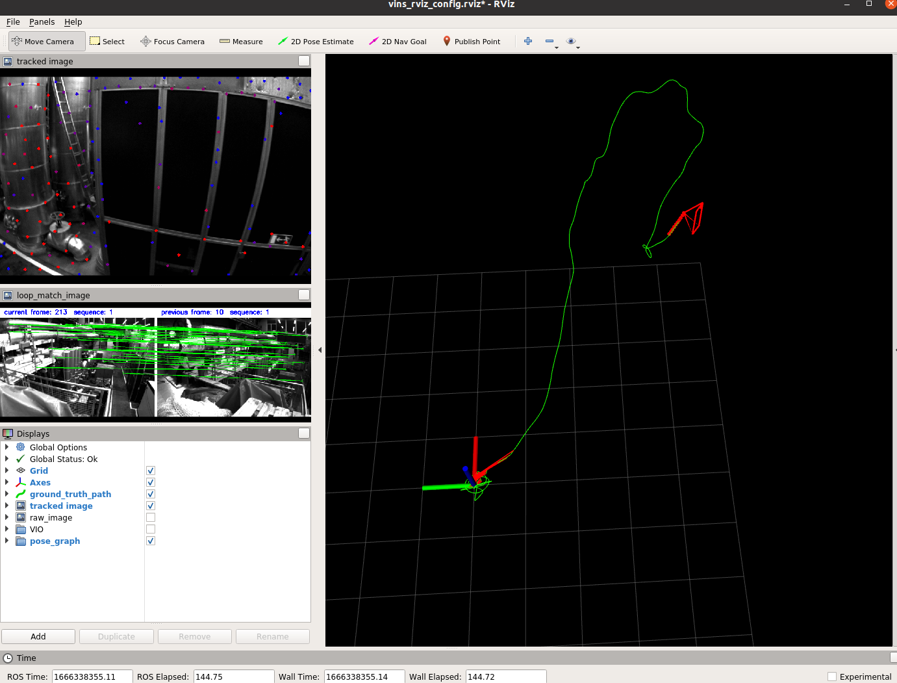

# VINS-Mono Docker

## 1. Pull image from docker hub

```
docker image pull jike5/vins-mono:cpu
```

> Maybe you need login first
>
> ```bash
> docker login -u [UserName]
> ```

## 2. Build image

You can modify the Dockerfile and build your own image:

```bash
docker image build -t jike5/vins-mono:cpu .
```

> For proxy:
>
> ```bash
> docker image build -t jike5/vins-mono:cpu . --build-arg HTTP_PROXY=http://127.0.0.1:58591 --build-arg HTTPS_PROXY=http://127.0.0.1:58591 --build-arg ALL_PROXY=socks5://127.0.0.1:51837 --network host
> ```

## 3. Run docker container

If it is the first time, you should run below to download and build vins-mono:

```bash
sudo ./build_container_cpu.sh
```

For the next time, just run below:

```bash
sudo ./build_container_vins.sh
```

> In vins_ws was modified by container user, you may need to change permission：
>
> ```bash
> sudo chmod 777 -R ./*
> ```

## 4. Euroc Example

First, you should check your Datasets directory in the `build_container_vins.sh`

```bash
-v [Your Euroc Dataset Path(absolute)]:/Datasets
```

Run the container:

```bash
docker exec -it vins bash
```

> Make sure you have run `build_container_cpu.sh` or `build_container_vins.sh` firstly.

```
source vins_ws/devel/setup.bash
roslaunch vins_estimator euroc.launch
roslaunch vins_estimator vins_rviz.launch
rosbag play [YOUR_PATH].bag
```



